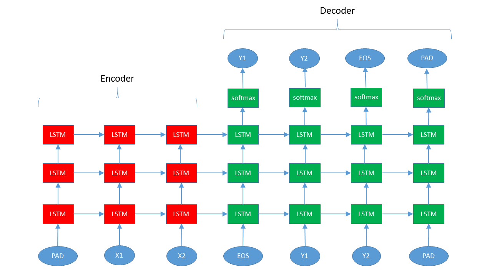

# seq2seq

* Encoder uses one set of transition parameters.
* Decoder uses another set of transition parameters.
* Only the decoder is connected to a layer of fully connected and softmax loss layer

